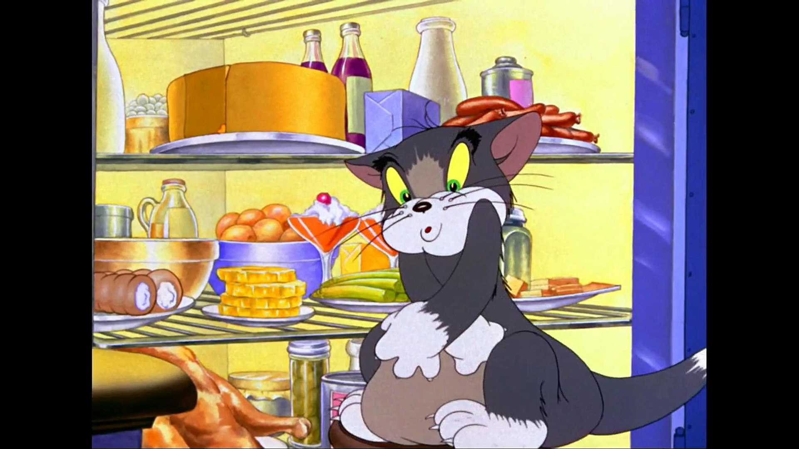

# Ночной дожор

## Описание

**"Ночной дожор"** — это захватывающая игра-квест в формате Telegram-бота, в которой вы погружаетесь в мир ночных приключений. Главная героиня — дочка, которая проснулась посреди ночи, испытав непередаваемое чувство голода. Её цель — добраться до холодильника, перекусить и вернуться обратно в свою постель, не став замеченной родителями.

## Как играть

Вам предстоит управлять действиями героини, выбирая различные варианты и принимая решения, которые могут повлиять на исход игры. На каждом этапе вы столкнетесь с уникальными ситуациями, которые потребуют от вас смекалки и осторожности:

1. **Исследуйте комнату**: Найдите предметы, которые могут помочь вам в вашем путешествии к холодильнику.
   
2. **Пройдите мимо родителей**: Будьте хитрыми! Ваша задача — избегать встречи с родителями, которые могут шастать по дому.

3. **Достигните холодильника**: Сделайте выбор между различными закусками и следите за уровнем голода героини.

4. **Возвращение в постель**: Как только вы перекусили, вам нужно будет вернуться в свою кровать, избегая ловушек и не привлекая внимания.

## Ключевые особенности

- **Увлекательный сюжет**: Откройте множество сценариев, основанных на ваших решениях.
- **Индивидуальность персонажа**: Главная героиня расказывает вам о своих желаниях, страхах и предпочтениях.
- **Интуитивно понятное управление**: Просто выбирайте действия и наблюдайте за развитием истории.
- **Секреты и достижения**: Исследуйте различные сюжетные линии и откройте достижения, которые добавят дополнительные элементы игры.

## Установка

Чтобы начать играть, просто найдите наш Telegram-бот и запустите игру, нажав кнопку "Старт". Вы можете начать своё увлекательное приключение прямо сейчас!

## Поддержка

Если у вас возникли вопросы или предложения, не стесняйтесь обращаться к команде разработчиков через наш [Telegram-канал](https://t.me/MidnightSnackGame).

## Лицензия

Этот проект лицензирован под [MIT License](LICENSE.txt).

---

Погрузитесь в увлекательные ночные приключения с "Ночной дожор" и помогите героине осуществить её кулинарные мечты!
